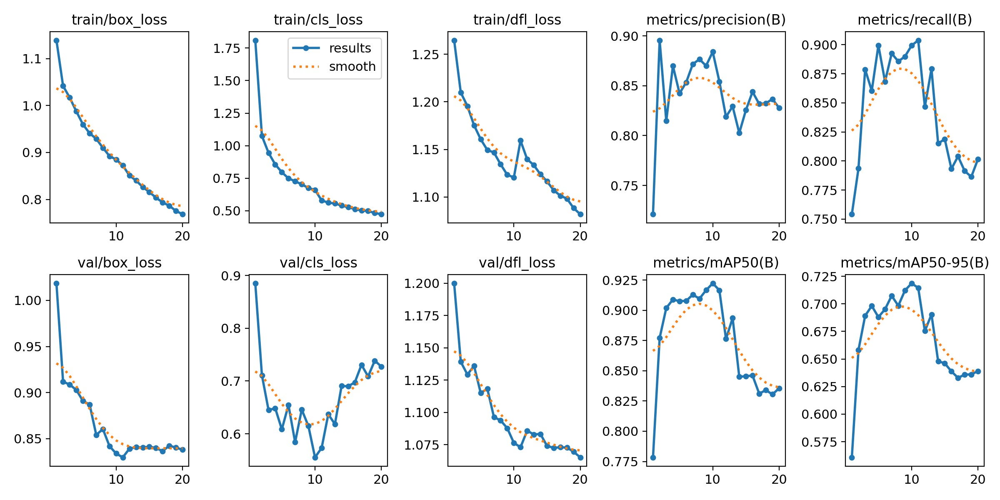
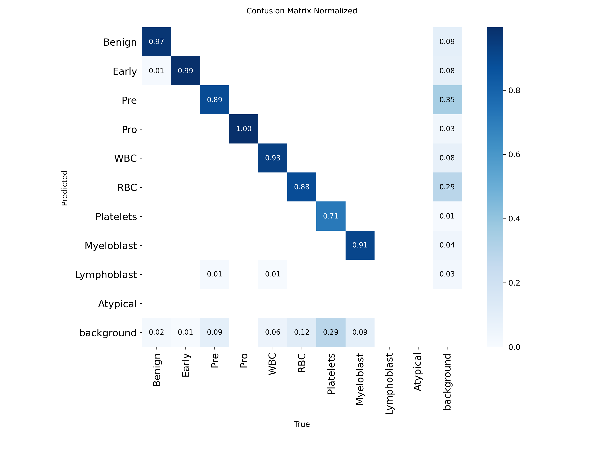
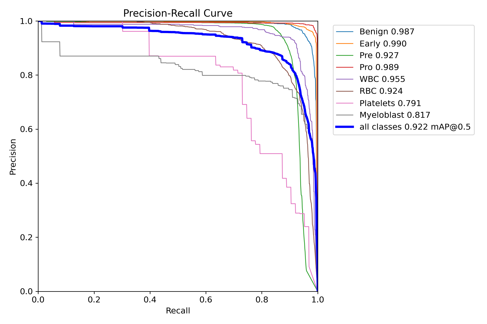
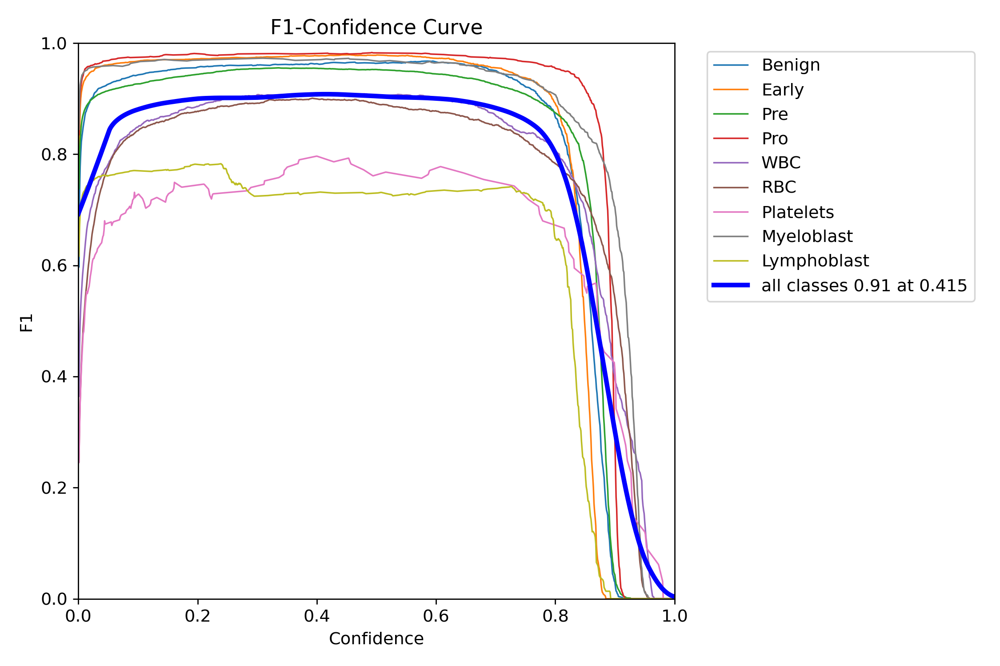

# Leukemic Blast Detection and Active Learning Pipeline

### [View the Project Documentation & Evaluation Plots →](https://abusuraihsakhri.github.io/blast-detection-algo/)

[](https://github.com/abusuraihsakhri/blast-detection-algo)
[](https://pytorch.org/)
[-brightgreen.svg)](https://github.com/ultralytics/ultralytics)
[](https://github.com/abusuraihsakhri/blast-detection-algo)
[](https://github.com/abusuraihsakhri/blast-detection-algo)
[](https://github.com/abusuraihsakhri/blast-detection-algo/releases/tag/v1.0.0)

A computer vision and active learning pipeline for detecting and classifying **Leukemic Blasts** in peripheral blood smears and Whole Slide Images (WSIs). Trained across **25,875 microscopy fields** (**115,548 annotated cells** across 6 curated cohorts). Features PyTorch YOLOv8 detection, sliding-window WSI tiling with boundary-aware Non-Maximum Suppression (NMS), a local review and sandbox web UI, and an Experience Replay Buffer that prevents catastrophic forgetting during incremental training.

---

## 📊 Evaluation Results (Multi-Center Dataset Benchmark)

The model was trained for 20 epochs on the unified dataset. Validation mAP@50 peaked at epoch 10 and fell to 83.55% by epoch 20, so the released checkpoint holds the epoch-10 weights. The validation split also chose that checkpoint, so the table reports the per-dataset test splits as well. The test splits were not used for training or selection.

| Metric | Validation (epoch 10) | Test split | Description |
| :--- | :---: | :---: | :--- |
| **mAP@50** | **92.23%** | **90.98%** | Mean AP at IoU 0.50 over the 8 classes with evaluation boxes |
| **Precision ($P$)** | **88.40%** | **86.40%** | Mean precision across classes |
| **Recall ($R$)** | **89.93%** | **89.73%** | Mean recall across classes |
| **mAP@50-95** | **71.86%** | **70.71%** | Mean AP averaged over IoU thresholds 0.50–0.95 |
| **Inference latency** | ≈ 3 ms / image | | 640 px, batch 16, RTX 3060 Laptop GPU, plus ≈ 1 ms NMS |
| **Parameters** | 3.01 million | | YOLOv8n |
| **Weights** | `data/models/active_model.pt` | | 6.25 MB, also attached to Release v1.0.0 |

### 📈 Convergence & Evaluation Plots

Per-class AP@50 on the test split: Benign 0.961, Early 0.988, Pre 0.939, Pro 0.994, WBC 0.955, RBC 0.930, Platelets 0.716, Myeloblast 0.797. Lymphoblast has no validation or test boxes (its only source has a train split only). Atypical has no boxes at all, so the released model has never seen an example of it.

**Limitations.** These are in-distribution numbers on the original per-dataset splits, and Leukemia-NFXZN supplies 74% of the validation boxes. All sources are camera images of smear fields. The model has not been evaluated on whole-slide scans, and tiles are not resampled to a common microns-per-pixel scale before inference.

| Training Loss & Convergence | Normalized Confusion Matrix |
| :---: | :---: |
|  |  |

| Precision-Recall Curve | F1-Confidence Calibration Curve |
| :---: | :---: |
|  |  |

*Trained weights are tracked at [`data/models/active_model.pt`](data/models/active_model.pt) and downloadable via [GitHub Release v1.0.0](https://github.com/abusuraihsakhri/blast-detection-algo/releases/tag/v1.0.0).*

---

## 🔬 Dataset Overview (25,875 Fields / 115,548 Cells)

The training data merges 6 public research datasets into a unified 10-class taxonomy:

| # | Dataset / Source | Scope / Target Classes | Train | Valid | Test | Total Images | Annotated Cells |
| :-: | :--- | :--- | :-: | :-: | :-: | :-: | :-: |
| **1** | **Leukemia-NFXZN** (Tawfiq Islam) | B-ALL subtyping (Benign, Early, Pre, Pro) | 6,589 | 622 | 312 | 7,523 | 83,854 |
| **2** | **Blast-Cell-Detection** (YOLOv4) | Binary blast vs leukocyte (blasts remapped to Pre) | 3,011 | 72 | 39 | 3,122 | 3,365 |
| **3** | **BCCD Blood Cell Foundation** | Baseline elements (WBC, RBC, Platelets) | 377 | 110 | 53 | 540 | 8,851 |
| **4** | **Blood-Cell-znm2t Differential** | Leukocyte differential (8 subtypes, all merged into WBC) | 9,105 | 389 | 387 | 9,881 | 10,589 |
| **5** | **Acute-Leukemia AML/ALL** | Myeloblast vs Lymphoblast (train split only) | 3,809 | 0 | 0 | 3,809 | 7,626 |
| **6** | **Myeloblast-fbliw Dedicated** | Acute myeloid leukemia blasts | 700 | 200 | 100 | 1,000 | 1,263 |
| | **Grand Total** | | **23,591** | **1,393** | **891** | **25,875** | **115,548** |

### 🏷️ Unified 10-Class Taxonomy

1. **Benign (0):** Non-neoplastic mature lymphocytes and normal cells.
2. **Early (1):** Early Pre-B Acute Lymphoblastic Leukemia blasts.
3. **Pre (2):** Pre B-ALL blasts.
4. **Pro (3):** Pro B-ALL blasts.
5. **WBC (4):** General mature white blood cells (neutrophils, eosinophils, monocytes).
6. **RBC (5):** Mature erythrocytes.
7. **Platelets (6):** Thrombocytes.
8. **Myeloblast (7):** Acute Myeloid Leukemia (AML) blasts.
9. **Lymphoblast (8):** Generic acute lymphoblastic leukemia blasts.
10. **Atypical (9):** Reserved for reviewer-assigned labels in the review UI. No source dataset maps to it, so it has no training examples.

---

## 🏛️ System Architecture

```text
[ Whole Slide Image (.svs / .ndpi / .tiff) or Microscopic Smear (.jpg / .png) ]
                                   │
                                   ▼
             [ Sliding-Window Tile Extraction Engine ]
             ├── Background Filtering (Luminance > 220, Threshold > 80%)
             └── 512×512 Sliding Window Tiling (25% Stride Overlap)
                                   │
                                   ▼
                [ Neural Detection Backbone ]
             ├── Architecture: YOLOv8n (3.01M Parameters)
             ├── 10-Class Taxonomy (ALL, AML, Normal Lineages)
             └── ≈ 3 ms / image on an RTX 3060 Laptop GPU
                                   │
                                   ▼
           [ Global Boundary Non-Maximum Suppression (NMS) ]
             ├── Local Tile Coordinates -> Global WSI Coordinates Re-Projection
             └── Vectorized Agnostic NMS (IoU = 0.45, Conf >= 0.25)
                                   │
                                   ▼
            [ Review and Sandbox Web Interface ]
             ├── Interactive Bounding Box Refinement & Class Reassignment
             └── Sandbox Inference with Dynamic Thresholding
                                   │
                                   ▼
             [ Experience Replay Buffer (HITL Fine-Tuning) ]
             ├── Stratified Historical Sampling (Replay Ratio = 4.0)
             └── Underrepresented Class Quota Multiplier (1.5x Boost)
```

---

## 🔬 Pipeline Capabilities & Workflows

1. **Smear Tile Screening:** Scans digitized blood smear fields and identifies candidate leukemic blasts for expert inspection.
2. **Whole Slide Image (WSI) Tiling:** Slices gigapixel SVS and TIFF slides into 512×512 tiles with 25% overlap, discards empty glass tiles, maps tile coordinates into slide space, and applies global Non-Maximum Suppression (NMS).
3. **Pre-B ALL Subtyping:** Distinguishes Early, Pre, and Pro B-cell lymphoblastic leukemia morphological stages across annotated microscopic fields.
4. **Myeloid vs. Lymphoid Discrimination:** Detects and separates myeloblasts (AML) from lymphoblasts (ALL) and normal hematopoietic elements.
5. **Human-in-the-Loop Active Learning:** A local FastAPI web interface enables reviewing model bounding boxes, adjusting classes, and assembling training sets via an experience replay buffer to prevent catastrophic forgetting.

---

## 🚀 Quickstart & Inference

### 1. Environment Setup
```bash
git clone https://github.com/abusuraihsakhri/blast-detection-algo.git
cd blast-detection-algo
python -m venv .venv
```

On Windows (PowerShell):
```powershell
.\.venv\Scripts\Activate.ps1
pip install -r requirements.txt
```

On Linux / macOS:
```bash
source .venv/bin/activate
pip install -r requirements.txt
```

### 2. Verify Pre-Loaded Model Weights
The active model weights are committed directly in the repository at `data/models/active_model.pt`. You can also download them from GitHub Releases:
```bash
# Optional: download official v1.0.0 release checkpoint
curl -L -o data/models/active_model.pt https://github.com/abusuraihsakhri/blast-detection-algo/releases/download/v1.0.0/active_model.pt
```

### 3. Launch Review & Sandbox UI
```bash
python app.py
```
Open your browser to `http://127.0.0.1:8000` to access the Active Learning Review Queue and the Sandbox Inference workspace.

### 4. Run Sliding-Window WSI Inference
```bash
python inference_pipeline.py /path/to/patient_slide.svs
```

### 5. Incremental Fine-Tuning (HITL Active Learning)
After reviewing and saving new tiles in the UI:
```bash
python training_pipeline.py --mode hitl
```

### 6. Automated Testing
```bash
pytest -q tests
python -m compileall -q -x "\.venv" .
node --check public/app.js
```

---

## 🔒 Security Hardening

- **Bounded File Uploads:** Constrained to `settings.max_upload_bytes` (default 25 MB) to prevent memory exhaustion.
- **MIME Type Whitelisting:** Strictly enforces image content-types (`image/jpeg`, `image/png`, `image/bmp`, `image/webp`).
- **Decompression Bomb Protection:** Configured with `settings.max_upload_pixels` (default 50 Megapixels) to defeat decompression bomb exploits.
- **Path Traversal Defenses:** All filesystem inputs and destinations are verified with `validate_path_within()` before reading or writing.
- **Origin Restriction & Security Headers:** Enforces `nosniff`, `DENY` frame-options, Content Security Policy, and binds CORS to local origins.
- **Private Sandbox Storage:** Temporary sandbox uploads are stored in an internal directory and not exposed via public static routes.

---

## ⚖️ License & Disclaimer

Distributed under the **Apache License 2.0**.

> **Research Use Only**: This software is intended for research, method evaluation, and algorithmic experimentation. It is not a certified diagnostic device and is not intended for primary clinical diagnosis without independent validation and regulatory approval.
